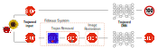

# Trojan Attack Overview

A Trojan attack demonstrating a backdoored model of a self-driving car run-ning a **STOP** sign that could cause a catastrophic accident. Left: Normal sign (benign input). Right: Trojaned sign (Tro-janed input with the Post-it note trigger) is recognized as a 100 km/h **speedlimit** by the Trojaned network.

# Overview of the Februus system

Overview of the **Februus System**. The Trojaned input is processed through the **Trojan Removal** module that inspects and surgically removes the trigger. Subsequently, the damaged input is processed by the **Image Restoration** module to recover the damaged regions. The restored image is fed into the Trojaned DNN. ***TOP***: Without Februus, the Trojaned input will trigger the backdoor and be misclassified as a 100 km/h **SPEED LIMIT** sign. **BOTTOM**: With Februus deployed, the Trojaned DNN still correctly classifies the Trojaned input as a **STOP** sign

### The methods devised can successfully apply the notion of input sanitization realized in an unsupervised setting to the visual inputs of a deep neural network system. This is indeed a new finding.

### Most interestingly, and perhaps for the first time, we show that deep perception models are able to achieve state-of-the-art performance post our proposed input sanitization method (that removes parts of an image and restores it prior to classification). 

